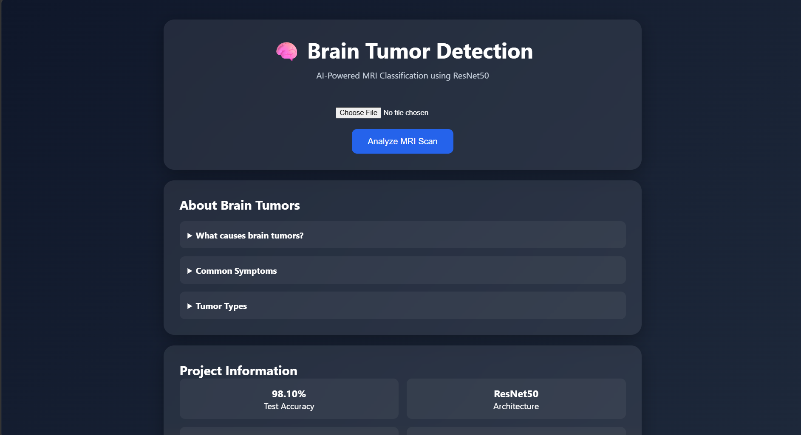
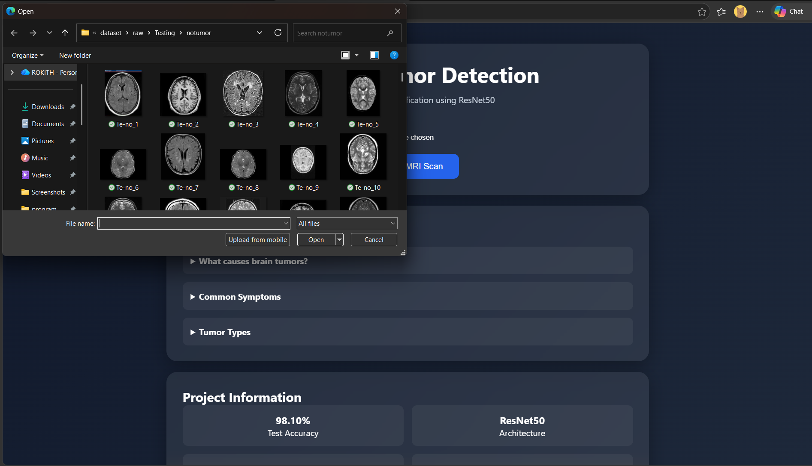
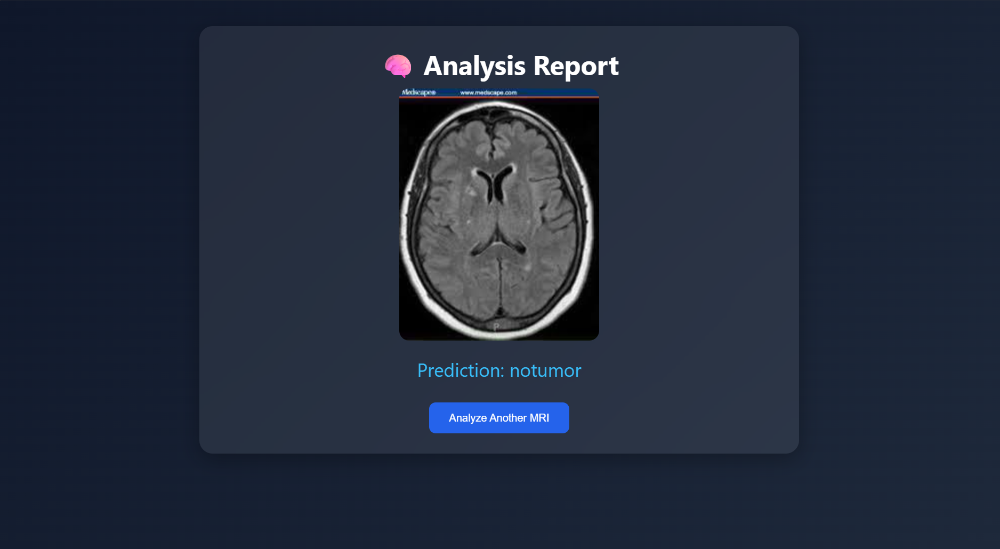
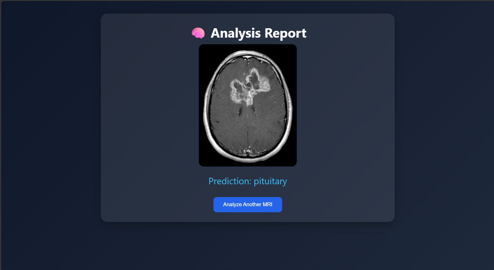

# 🧠 AI-Powered Brain Tumor Detection from MRI Images


---

## 📌 Project Overview

Brain tumors are among the most serious neurological disorders, where early detection and accurate classification play a crucial role in treatment planning.

This project presents an **AI-powered Brain Tumor Detection application** that classifies MRI brain scans into different tumor categories using **Transfer Learning with ResNet50**. The trained model is deployed through a **Flask web application**, allowing users to upload MRI images and receive instant predictions.

The system achieved a **98.10% Test Accuracy** and provides real-time classification through an interactive web interface.

---

## ✨ Features

* 🧠 Brain Tumor Classification from MRI Images
* 🚀 Transfer Learning using ResNet50
* 📊 Achieved 98.10% Test Accuracy
* 🖼️ MRI Image Upload Interface
* ⚡ Real-Time Predictions
* 🌐 Flask Web Application
* 📈 Data Augmentation & Preprocessing
* 🎯 End-to-End Deep Learning Pipeline
* 🎨 Modern AI Dashboard UI

---

## 🔄 Project Workflow

```text
MRI Image
     │
     ▼
Image Preprocessing
(Resize → Normalize)
     │
     ▼
ResNet50 Model
(Transfer Learning)
     │
     ▼
Prediction Layer
     │
     ▼
Tumor Classification
     │
     ▼
Flask Web Application
```

---

## 📊 Dataset Information

### Dataset

Brain Tumor MRI Dataset

### Classes

* Glioma
* Meningioma
* Pituitary
* No Tumor

### Dataset Split

| Dataset    | Percentage |
| ---------- | ---------- |
| Training   | 70%        |
| Validation | 15%        |
| Testing    | 15%        |

---

## 🧹 Data Preprocessing

The following preprocessing techniques were applied:

* Image Resizing (224 × 224)
* Image Normalization
* Random Horizontal Flip
* Random Rotation
* Brightness Adjustment
* Contrast Adjustment
* Tensor Conversion

These transformations improve model generalization and reduce overfitting.

---

## 🏗️ Model Architecture

### ResNet50 Transfer Learning

Instead of training a CNN from scratch, a pretrained **ResNet50** model was used.

The final fully connected layer was replaced to support tumor classification.

```text
Input MRI Image
       │
       ▼
Pretrained ResNet50
       │
       ▼
Feature Extraction
       │
       ▼
Fully Connected Layer
       │
       ▼
Tumor Classification
```

### Training Configuration

| Parameter     | Value              |
| ------------- | ------------------ |
| Model         | ResNet50           |
| Framework     | PyTorch            |
| Optimizer     | Adam               |
| Learning Rate | 0.001              |
| Batch Size    | 32                 |
| Epochs        | 10                 |
| Loss Function | Cross Entropy Loss |

---

## 📈 Model Performance

### Training Results

| Metric                  | Value  |
| ----------------------- | ------ |
| Final Training Accuracy | 97.40% |
| Test Accuracy           | 98.10% |

### Epoch Performance

```text
Epoch 1  → 86.45%
Epoch 2  → 92.50%
Epoch 3  → 94.11%
Epoch 4  → 94.46%
Epoch 5  → 95.87%
Epoch 6  → 96.84%
Epoch 7  → 95.97%
Epoch 8  → 97.76%
Epoch 9  → 97.09%
Epoch 10 → 97.40%
```

---

# 📸 Application Screenshots

## 🏠 Home Dashboard

The landing page allows users to upload MRI scans and learn about brain tumors through an interactive AI dashboard.



---

## 🧠 MRI Analysis Result

After uploading an MRI image, the model predicts the tumor category and displays the result through the Flask application.



---

## 📈 Model Training Performance

Training progress of the ResNet50 model showing continuous improvement in classification accuracy over multiple epochs.



---

## 🎯 Final Test Accuracy

Evaluation results on unseen MRI images demonstrating the model's strong generalization performance.



---

## 📁 Project Structure

```text
brain-tumor-detection/
│
├── dataset/
│
├── model/
│   └── brain_tumor_model.pth
│
├── notebooks/
│   ├── 01_data_preparation.ipynb
│   ├── 02_eda.ipynb
│   └── 03_model_training.ipynb
│
├── src/
│   └── predict.py
│
├── static/
│   ├── css/
│   │   └── style.css
│   └── uploads/
│
├── templates/
│   ├── index.html
│   └── result.html
│
├── screenshots/
│   ├── mripg1.png
│   ├── mripg2.png
│   ├── mripg3.png
│   └── mripg4.png
│
├── app.py
├── requirements.txt
└── README.md
```

---

## 🚀 Installation

### Clone Repository

```bash
git clone https://github.com/your-username/brain-tumor-detection.git

cd brain-tumor-detection
```

### Create Virtual Environment

```bash
python -m venv venv
```

### Activate Environment

#### Windows

```bash
venv\Scripts\activate
```

#### Linux / macOS

```bash
source venv/bin/activate
```

### Install Dependencies

```bash
pip install -r requirements.txt
```

---

## ▶️ Run Application

```bash
python app.py
```

Open:

```text
http://127.0.0.1:5000
```

Upload an MRI image and receive a real-time prediction.

---

## 🛠️ Technology Stack

### Programming Language

* Python

### Deep Learning

* PyTorch
* Torchvision

### Data Processing

* NumPy
* Pandas

### Visualization

* Matplotlib
* Seaborn

### Computer Vision

* Pillow (PIL)

### Web Application

* Flask

### Frontend

* HTML
* CSS

---

## 🔮 Future Improvements

* Confidence Score Display
* Grad-CAM Visualization
* Mobile Responsive UI
* Cloud Deployment
* Docker Containerization
* Multi-Class Probability Charts
* Medical Report Generation

---

## ⚠️ Medical Disclaimer

This project is developed for educational and research purposes only.

The predictions generated by the model should not be considered medical advice or used as a substitute for professional diagnosis. Always consult a qualified healthcare professional for medical decisions.

---

## 👨‍💻 Author

**Rokith**

AI / Data Engineering Enthusiast

If you found this project useful, consider giving it a ⭐ on GitHub.
